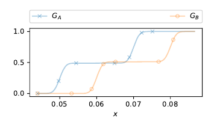

# SupplementaryPaperRVCompare

Repo for reproducing the figures in the [paper](
https://doi.org/10.48550/arXiv.2203.07889). The code in this repo was tested in a clean install of Ubuntu 20.04.


## Installation


Install dependencies with apt:

```bash
sudo apt update
sudo apt install r-base
sudo apt install python3-pip
sudo apt install python3-tk
sudo apt install libssl-dev
sudo apt install libxml2-dev
sudo apt install libcurl4-openssl-dev

```

R packages:
```bash
# Load R session
R

# Install packages
install.packages("pacman") # say yes if asked
pacman::p_load(RVCompare, ggplot2, MCMCpack, devtools, geometry)
pacman::p_load_gh("b0rxa/scmamp")
if (!requireNamespace("BiocManager", quietly = TRUE))
    install.packages("BiocManager")
BiocManager::install("graph")
```


For the python dependencies, 

```bash
pip3 install tqdm
pip3 install numpy
pip3 install pandas
pip3 install matplotlib
pip3 install tensorflow
pip3 install keras
```

---


## Generating the Figures


### Figure 1


#### Step 0 (*Optional, takes a lot of time*): 
Delete the previously computed results and compute them again. Note that this will take a lot of time, as 10000 samples for each algorithm are required.

```bash
rm data/scoresA.csv
rm data/scoresB.csv
```

Generate the samples for A - *ADAM*:

```bash
python3 get_sample.py A
```
Wait until the 10000th sample is generated (seed = 10000 will be printed).

Then we do the same for B - *RMSProp*.

```bash
python3 get_sample.py B
```
Again wait untill 10000 samples are generated.


#### Step 1: 

Plot the figure from the generated samples.

```bash
python3 plot_distribution_X1.py
```


<br />
<br />

---

<br />
<br />

### Figure 2


```bash
python3 plot_figure2.py
```


<br />
<br />

---

<br />
<br />


### Figure 3 (example_1_mean_median.pdf)


### Figure 4 (example_2_mean_median.pdf)


### Figure 5a (example_1_cdf.pdf) and 5b (example_2_cdf.pdf)





### Figure 6 (example_5_mean_median.pdf)


Figures 3-6 are generated with:

```bash
python3 plot_examples_for_figures3456.py
```

<br />
<br />

---

<br />
<br />


### Figure 7


```bash
python3 plot_figure7.py
```

<br />
<br />

---

<br />
<br />


### Figure 10 (Example2_xprimaAB.pdf)


### Figure 12 (Example2_xprimaABDiff.pdf)


```bash
Rscript estimate_cumulative_X_prima_generated.R
```


<br />
<br />

---

<br />
<br />


### Figure 13


```bash
Rscript plot_figure13.R
```

<br />
<br />

---

<br />
<br />

### PL-EDA vs PL-GS (Figures 14-17)

#### Step 0 (*Optional, takes a lot of time*): 
Delete the previously computed results and compute them again. Execute the launch_pleda_gradient.sh script with a parameter indicating the number of parallel processes to launch. For example, to launch 4 parallel processes, 

```bash
bash launch_pleda_gradient.sh 4
```


Wait until the 10000th sample is generated (seed = 10000 will be printed).

Then we do the same for B - *RMSProp*.

```bash
python3 get_sample.py B
```
Again wait untill 10000 samples are generated.


#### Step 1: 

Plot the figure from the generated samples.

```bash
python3 plot_distribution_X1.py
```


## License
[CC0](https://creativecommons.org/choose/zero/)


NOTE: The folder on data/pleda_gradient contains code from other authors so CC0 does not apply to this folder. Please contact them for more info on their license.